# app-timefiller-wakaba
Sharing hub application

## アプリ配備
タイムフィリングアプリをアプリセルに配備する為の手順を説明します。アカウント名やロール名などは必ずしも説明通りにする必要はありません。変更した場合は変更後の名前に置き換えてください。

1. アプリセルを準備してください。アプリセルの作成についてはcell-creatorやunit-managerを使用して下さい。

1. アプリセルに次のRoleを作成して下さい。  
 ・syncAccToken  
 ・syncTarget  
 ・writeOData  
 ・admin  
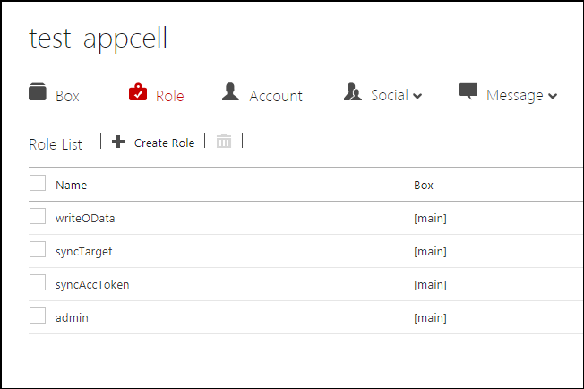

1. アプリセルに次のアカウントを作成して下さい。  
 ・tokenAcc  
 ・adminUser  
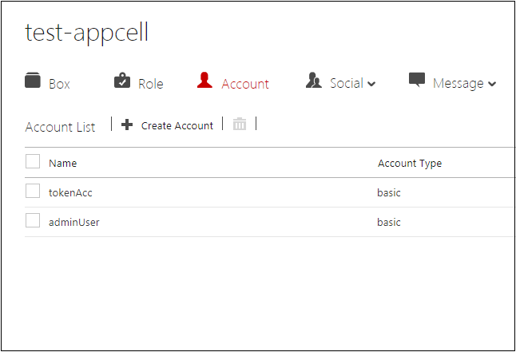

1. 作成したアカウントに次のRoleを付与して下さい。  
 ・tokenAcc:syncAccToken  
 ・adminUser:admin  
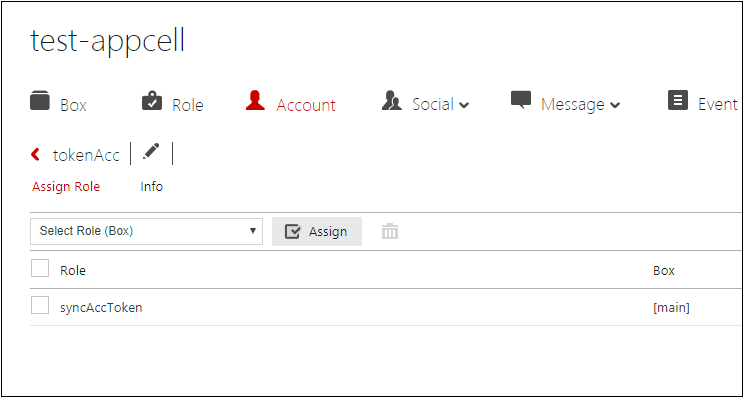
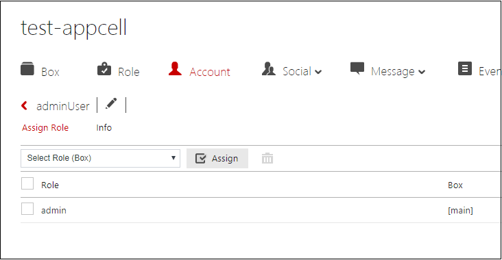

1. 作成したRoleに次の権限を付与して下さい。  
 ・syncAccToken:auth-read,social-read  
 ・admin:root  
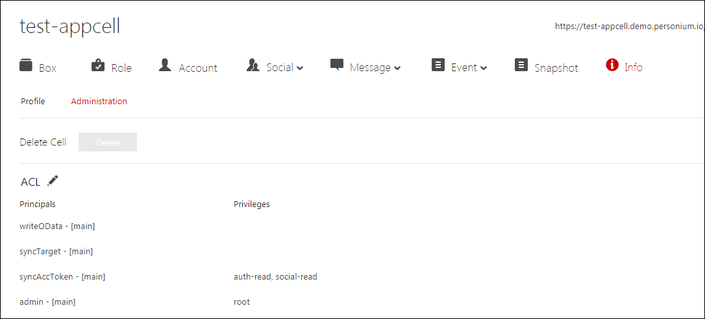 

1. アプリセルのmain配下にソースを配備して下さい。  
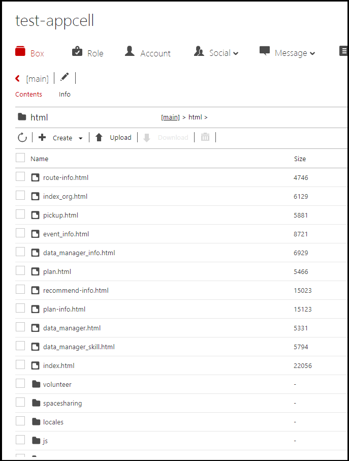

1. アプリセルのmain配下にMyDataを配備します。
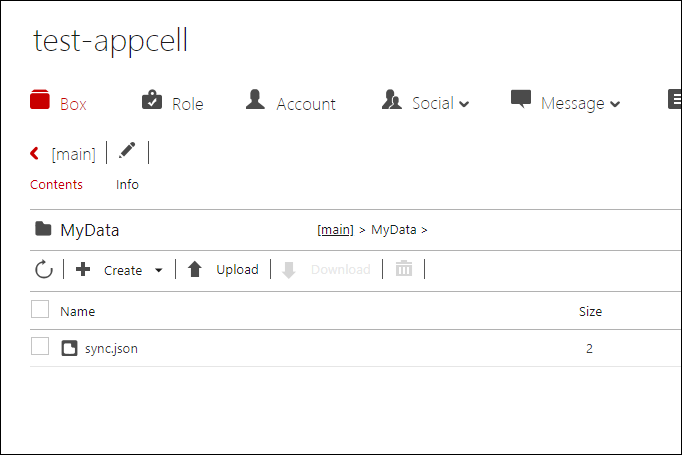

1. 以下のEngineサービスを作成して下さい。  
 ・deleteEventList  
 ・getAppAuthToken  
 ・getEvent  
 ・getPCalendarSchedule  
 ・receive_redirect  
 ・syncEventList  
 ・start_oauth2  
 ・createOData  

1. MyDataにACLを設定して下さい。  
 ・syncAccToken:read,write  
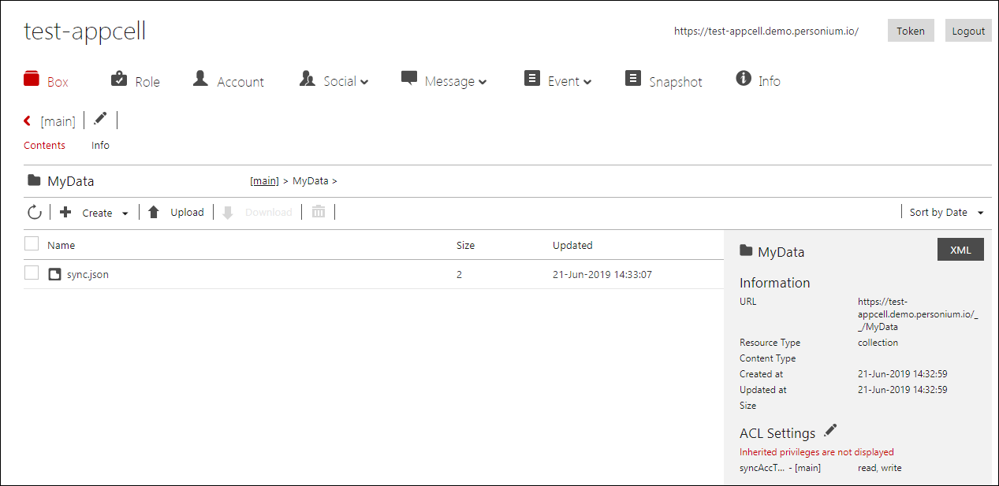

1. launch.jsonにACLを設定して下さい。  
 ・all:read  
 

1. __/html/Engine/src/acc_info.jsのappCellUrlにアプリセルURLとappUserIdにtokenAccを設定して下さい。  
   appUserPassには作成時に登録したパスワードを設定して下さい。  
   PersoniumCalendarと連携する場合、PersoniumCalendarのアカウントをcoopUserIdに設定して下さい。
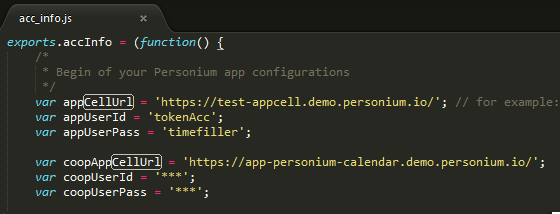

1. __/html/Engine/src/createOData.jsのcellUrlにアプリセルURLとcellAccにadminUserを設定して下さい。  
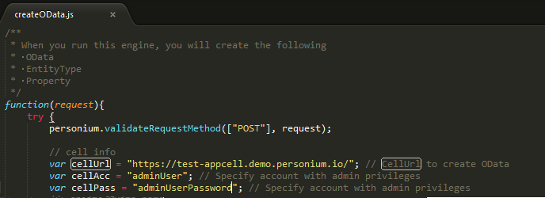

1. __/html/EngineにACLを設定して下さい。  
 ・all:exec
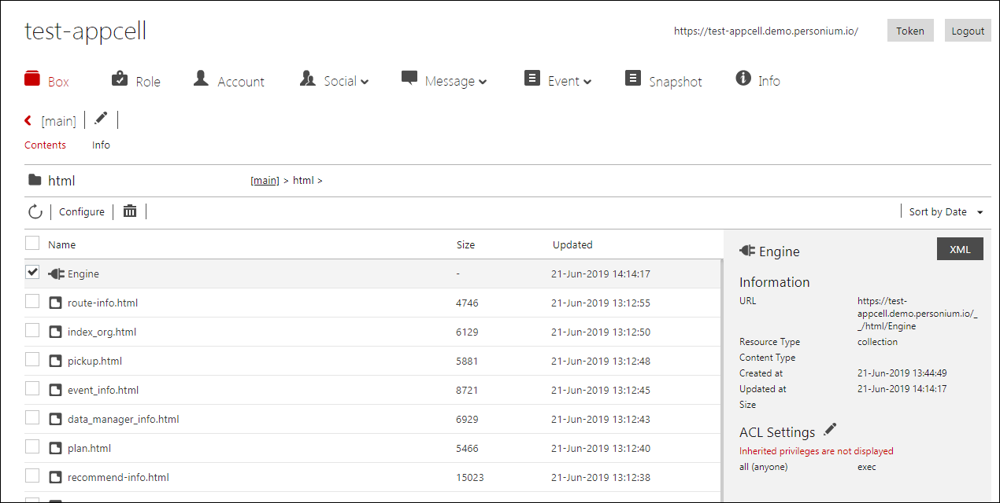

1. createODataを実行し、ODataを作成して下さい。  
例ではRestlet Clientを使っています。  
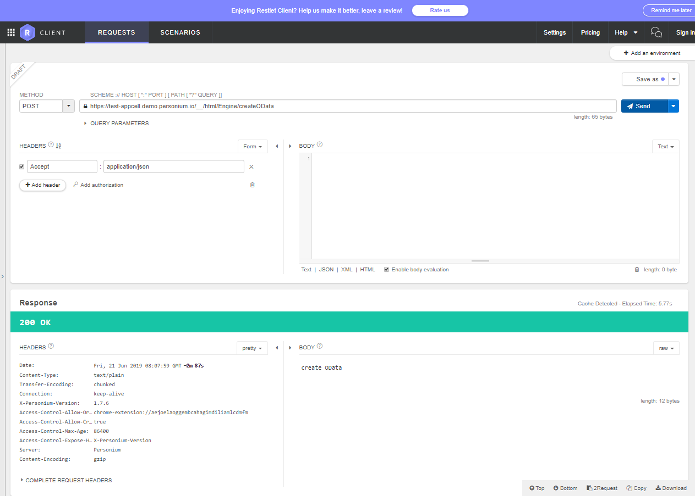

1. 作成したODataにACLを設定して下さい。  
 ・all:read
 ・writeOData:read,write

1. __/html配下のEngine以外のファイルにACLを設定して下さい。  
 ・all:read
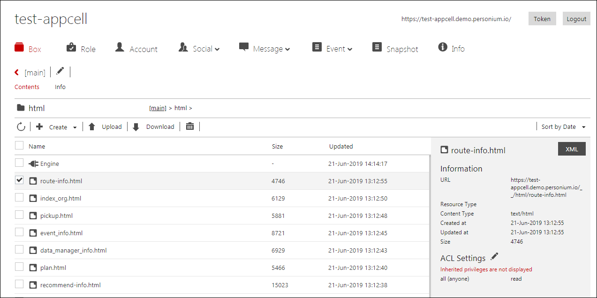
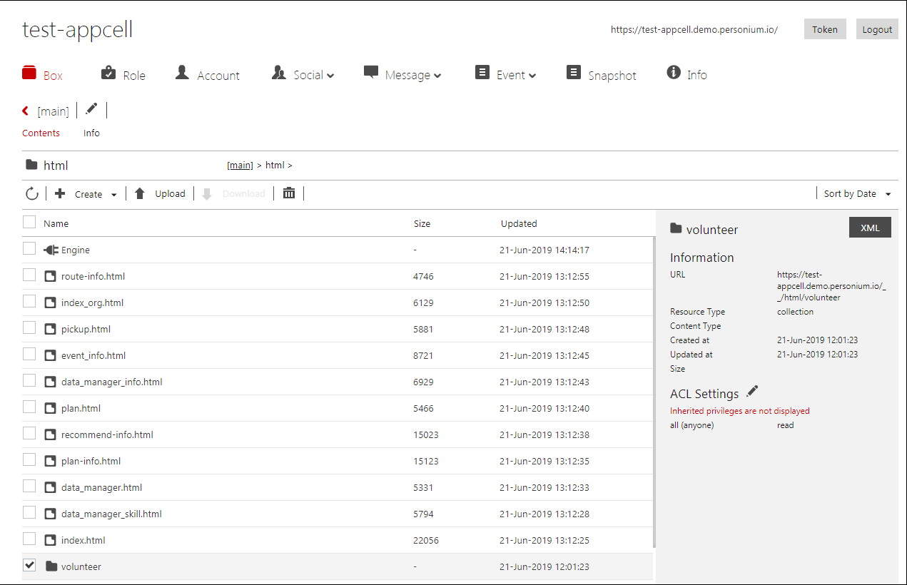

## EventList同期用のRule作成
1. 条件を以下の用に設定して下さい。  
 ・Name: syncEventList  
 ・Box: [main]  
 ・Action: exec  
 ・EventType: timer.periodic  
 ・EventObject: 5  
 ・TargetUrl: personium-localcell:/__/html/Engine/syncEventList  
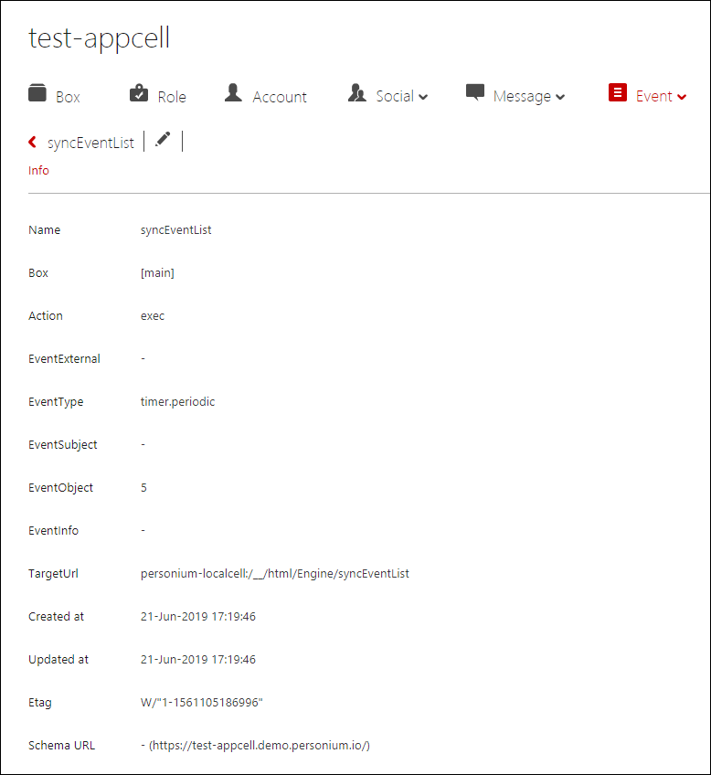

## EventListの同期対象を追加する
1. 外部セルに同期対象のCellUrlを登録して下さい。
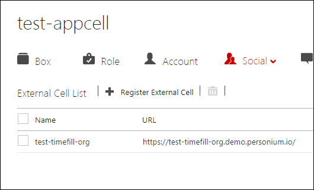

1. 登録した外部セルにロールを付与して下さい。  
 ・syncTarget　　
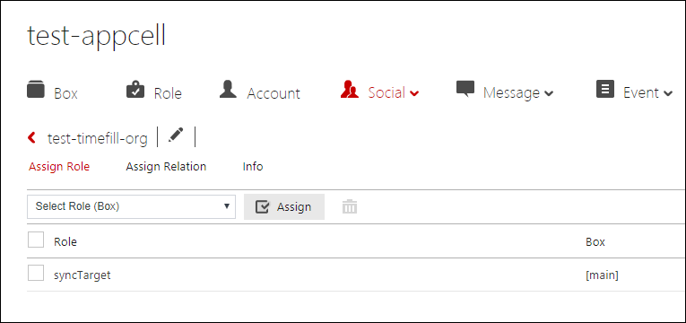